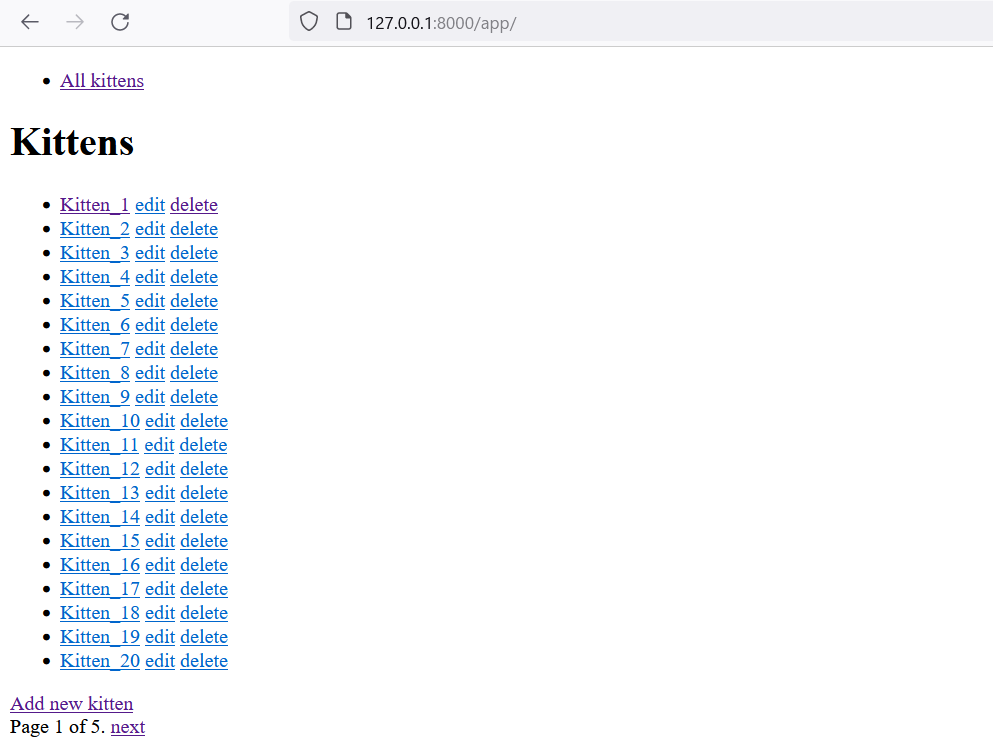

# Kitten API

Creating, updating and deleting kitten data

Serving html and json data

Contains 14 tests

# Python and used packages

- Python 3.12.61
- Django 5.0.2
- python-dotenv 1.0.0

# dotenv

with the .env file the secret key can be set:

SECRET_KEY=some_secret_key

# How to use

## 1. Clone the repository
    git clone
## 2. (optional) create a virtual environment
Example venv:

    python -m venv venv .

## 3. Install the dependencies from requirements.txt
    pip install -r requirements.txt
## 4. Apply migrations
    python manage.py migrate
## 5. Run server
     python manage.py runserver
## 6. Create user for login
    python manage.py createsuperuser
## 7. (optional) For seeding database with example data
    python manage.py seed
seed configuration for the seed command can be found at management/commands/seeds.py
## 8. (optional) For testing
    python manage.py test
Testing files can be found inside management/tests/

# Routes 

## html

```
/
├── admin/
└── app/
      ├──/
      └── kitten/
            ├── create/
            └── {id}/
                  ├── edit/
                  └── delete/
```

## json

```
/
└── app/
      ├──/
      └── kitten/{id}/
```

# Pages
<details>
  <summary>Open</summary>
    
  ## 1. Index
  

  ## 2. Event detail
  

  ## 3. create
  

  ## 4. update
  

  ## 5. delete
  

  ## 6. admin
  

</details>